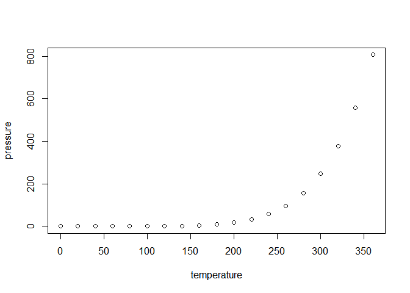

This file is a merged representation of the entire codebase, combining all repository files into a single document.
Generated by Repomix on: 2026-10-03 18:06:36

# File Summary

## Purpose:

This file contains a packed representation of the entire repository's contents.
It is designed to be easily consumable by AI systems for analysis, code review,
or other automated processes.

## File Format:

The content is organized as follows:
1. This summary section
2. Repository information
3. Repository structure
4. Multiple file entries, each consisting of:
   a. A header with the file path (## File: path/to/file)
   b. The full contents of the file in a code block

## Usage Guidelines:

- This file should be treated as read-only. Any changes should be made to the
  original repository files, not this packed version.
- When processing this file, use the file path to distinguish
  between different files in the repository.
- Be aware that this file may contain sensitive information. Handle it with
  the same level of security as you would the original repository.

## Notes:

- Some files may have been excluded based on .gitignore rules and Repomix's
  configuration.
- Binary files are not included in this packed representation. Please refer to
  the Repository Structure section for a complete list of file paths, including
  binary files.

## Additional Information:

For more information about Repomix, visit: https://github.com/andersonby/python-repomix


# Repository Structure

```
.gitignore
.Rbuildignore
DESCRIPTION
LICENSE
LICENSE.md
man
  calc_log_bf.Rd
  mirageV2-package.Rd
  new_mirage_result.Rd
  new_mirage_vs_result.Rd
  validate_mirage_data.Rd
  validate_mirage_params.Rd
mirageV2.Rproj
NAMESPACE
R
  bayes_factors.R
  classes.R
  mirageV2-package.R
  RcppExports.R
  validate.R
README.md
README.Rmd
repomix-output-unit3.md
src
  bayes_factors.cpp
  RcppExports.cpp
tests
  testthat.R
```

# Repository Files


## .gitignore

```text
.Rproj.user
```

## .Rbuildignore

```text
^mirageV2\.Rproj$
^\.Rproj\.user$
^README\.Rmd$
^LICENSE\.md$
```

## DESCRIPTION

```text
Package: mirageV2
Title: Mixture Model Based Rare Variant Analysis on Genes (v2)
Version: 0.1.0
Authors@R: c(
    person("Anson", "Li", email = "liyuanrui618@gmail.com", role = c("aut", "cre")),
    person("Shengtong", "Han", role = "aut")
  )
Description: A refactored successor to the 'mirage' package.
License: MIT + file LICENSE
Imports: 
    cli,
    Rcpp,
    rlang
Suggests: 
    testthat (>= 3.0.0)
LinkingTo: 
    Rcpp
Config/testthat/edition: 3
Encoding: UTF-8
Roxygen: list(markdown = TRUE)
Config/roxygen2/version: 8.1.0
RoxygenNote: 8.1.0
```

## LICENSE

```text
YEAR: 2026
COPYRIGHT HOLDER: Anson Li, Shengtong Han
```

## LICENSE.md

```markdown
# MIT License

Copyright (c) 2026 Anson Li, Shengtong Han

Permission is hereby granted, free of charge, to any person obtaining a copy
of this software and associated documentation files (the "Software"), to deal
in the Software without restriction, including without limitation the rights
to use, copy, modify, merge, publish, distribute, sublicense, and/or sell
copies of the Software, and to permit persons to whom the Software is
furnished to do so, subject to the following conditions:

The above copyright notice and this permission notice shall be included in all
copies or substantial portions of the Software.

THE SOFTWARE IS PROVIDED "AS IS", WITHOUT WARRANTY OF ANY KIND, EXPRESS OR
IMPLIED, INCLUDING BUT NOT LIMITED TO THE WARRANTIES OF MERCHANTABILITY,
FITNESS FOR A PARTICULAR PURPOSE AND NONINFRINGEMENT. IN NO EVENT SHALL THE
AUTHORS OR COPYRIGHT HOLDERS BE LIABLE FOR ANY CLAIM, DAMAGES OR OTHER
LIABILITY, WHETHER IN AN ACTION OF CONTRACT, TORT OR OTHERWISE, ARISING FROM,
OUT OF OR IN CONNECTION WITH THE SOFTWARE OR THE USE OR OTHER DEALINGS IN THE
SOFTWARE.
```

## man/calc_log_bf.Rd

```text
% Generated by roxygen2: do not edit by hand
% Please edit documentation in R/bayes_factors.R
\name{calc_log_bf}
\alias{calc_log_bf}
\title{Calculate Log Bayes Factors for Variants}
\usage{
calc_log_bf(var_case, var_contr, gamma, sigma, N1, N0)
}
\arguments{
\item{var_case}{Integer vector of variant counts in cases.}

\item{var_contr}{Integer vector of variant counts in controls.}

\item{gamma}{Numeric vector of shape hyperparameters.}

\item{sigma}{Numeric vector of scale hyperparameters.}

\item{N1}{Total sample size in cases.}

\item{N0}{Total sample size in controls.}
}
\value{
Numeric vector of log Bayes Factors.
}
\description{
Vectorized C++ helper for computing variant-level log Bayes Factors.
Uses adaptive Simpson's rule in log-space to prevent numerical over/underflow.
}
\keyword{internal}
```

## man/mirageV2-package.Rd

```text
% Generated by roxygen2: do not edit by hand
% Please edit documentation in R/mirageV2-package.R
\docType{package}
\name{mirageV2-package}
\alias{mirageV2}
\alias{mirageV2-package}
\title{mirageV2: Mixture Model Based Rare Variant Analysis on Genes (v2)}
\description{
A refactored successor to the 'mirage' package.
}
\author{
\strong{Maintainer}: Anson Li \email{liyuanrui618@gmail.com}

Authors:
\itemize{
  \item Anson Li \email{liyuanrui618@gmail.com}
  \item Shengtong Han
}

}
\keyword{internal}
```

## man/new_mirage_result.Rd

```text
% Generated by roxygen2: do not edit by hand
% Please edit documentation in R/classes.R
\name{new_mirage_result}
\alias{new_mirage_result}
\title{Construct a mirage_result object}
\usage{
new_mirage_result(
  delta_est,
  eta_est,
  bf_pp_gene,
  bf_all,
  original_categories,
  call
)
}
\arguments{
\item{delta_est}{Data frame of delta estimates.}

\item{eta_est}{Data frame of eta estimates.}

\item{bf_pp_gene}{Data frame of gene-level Bayes Factors and Posterior Probabilities.}

\item{bf_all}{List of variant-level Bayes Factors per gene.}

\item{original_categories}{The original category labels before internal re-indexing.}

\item{call}{The matched call.}
}
\value{
An object of class \code{mirage_result}.
}
\description{
Construct a mirage_result object
}
\keyword{internal}
```

## man/new_mirage_vs_result.Rd

```text
% Generated by roxygen2: do not edit by hand
% Please edit documentation in R/classes.R
\name{new_mirage_vs_result}
\alias{new_mirage_vs_result}
\title{Construct a mirage_vs_result object}
\usage{
new_mirage_vs_result(eta_est, full_info, post_prob, original_categories, call)
}
\arguments{
\item{eta_est}{Data frame of eta estimates.}

\item{full_info}{Data frame of variant-level information and Bayes Factors.}

\item{post_prob}{Data frame of variant-level Posterior Probabilities.}

\item{original_categories}{The original category labels.}

\item{call}{The matched call.}
}
\value{
An object of class \code{mirage_vs_result}.
}
\description{
Construct a mirage_vs_result object
}
\keyword{internal}
```

## man/validate_mirage_data.Rd

```text
% Generated by roxygen2: do not edit by hand
% Please edit documentation in R/validate.R
\name{validate_mirage_data}
\alias{validate_mirage_data}
\title{Validate and Clean MIRAGE Input Data}
\usage{
validate_mirage_data(data, type = c("gene", "vs"))
}
\arguments{
\item{data}{A data frame containing variant counts.}

\item{type}{Either "gene" or "vs".}
}
\value{
A cleaned data frame with S3 class \code{mirage_data}.
}
\description{
Validate and Clean MIRAGE Input Data
}
\keyword{internal}
```

## man/validate_mirage_params.Rd

```text
% Generated by roxygen2: do not edit by hand
% Please edit documentation in R/validate.R
\name{validate_mirage_params}
\alias{validate_mirage_params}
\title{Validate MIRAGE EM Algorithm Parameters}
\usage{
validate_mirage_params(
  n1,
  n2,
  gamma,
  sigma,
  eta.init,
  delta.init,
  estimate.delta,
  estimate.eta,
  fixed.eta,
  max.iter,
  tol,
  num_categories,
  type = "gene"
)
}
\description{
Validate MIRAGE EM Algorithm Parameters
}
\keyword{internal}
```

## mirageV2.Rproj

```text
Version: 1.0

RestoreWorkspace: No
SaveWorkspace: No
AlwaysSaveHistory: Default

EnableCodeIndexing: Yes
UseSpacesForTab: Yes
NumSpacesForTab: 2
Encoding: UTF-8

RnwWeave: Sweave
LaTeX: pdfLaTeX

AutoAppendNewline: Yes
StripTrailingWhitespace: Yes
LineEndingConversion: Posix

BuildType: Package
PackageUseDevtools: Yes
PackageInstallArgs: --no-multiarch --with-keep.source
PackageRoxygenize: rd,collate,namespace
```

## NAMESPACE

```text
# Generated by roxygen2: do not edit by hand

S3method(print,mirage_result)
S3method(print,mirage_vs_result)
importFrom(Rcpp,sourceCpp)
useDynLib(mirageV2, .registration = TRUE)
```

## R/bayes_factors.R

```text
#' Calculate Log Bayes Factors for Variants
#'
#' Vectorized C++ helper for computing variant-level log Bayes Factors.
#' Uses adaptive Simpson's rule in log-space to prevent numerical over/underflow.
#'
#' @param var_case Integer vector of variant counts in cases.
#' @param var_contr Integer vector of variant counts in controls.
#' @param gamma Numeric vector of shape hyperparameters.
#' @param sigma Numeric vector of scale hyperparameters.
#' @param N1 Total sample size in cases.
#' @param N0 Total sample size in controls.
#' @return Numeric vector of log Bayes Factors.
#' @keywords internal
calc_log_bf <- function(var_case, var_contr, gamma, sigma, N1, N0) {
  n <- length(var_case)
  gamma_vec <- rep_len(gamma, n)
  sigma_vec <- rep_len(sigma, n)

  calc_log_bf_var_cpp(
    var_case = as.integer(var_case),
    var_contr = as.integer(var_contr),
    gamma_vec = as.numeric(gamma_vec),
    sigma_vec = as.numeric(sigma_vec),
    N1 = as.numeric(N1),
    N0 = as.numeric(N0)
  )
}
```

## R/classes.R

```text
#' Construct a mirage_result object
#'
#' @param delta_est Data frame of delta estimates.
#' @param eta_est Data frame of eta estimates.
#' @param bf_pp_gene Data frame of gene-level Bayes Factors and Posterior Probabilities.
#' @param bf_all List of variant-level Bayes Factors per gene.
#' @param original_categories The original category labels before internal re-indexing.
#' @param call The matched call.
#' @return An object of class `mirage_result`.
#' @keywords internal
new_mirage_result <- function(delta_est, eta_est, bf_pp_gene, bf_all,
                              original_categories, call) {
  structure(
    list(
      delta.est = delta_est,
      eta.est = eta_est,
      BF.PP.gene = bf_pp_gene,
      BF.all = bf_all,
      original_categories = original_categories,
      call = call
    ),
    class = "mirage_result"
  )
}

#' Construct a mirage_vs_result object
#'
#' @param eta_est Data frame of eta estimates.
#' @param full_info Data frame of variant-level information and Bayes Factors.
#' @param post_prob Data frame of variant-level Posterior Probabilities.
#' @param original_categories The original category labels.
#' @param call The matched call.
#' @return An object of class `mirage_vs_result`.
#' @keywords internal
new_mirage_vs_result <- function(eta_est, full_info, post_prob,
                                 original_categories, call) {
  structure(
    list(
      eta.est = eta_est,
      full.info = full_info,
      post.prob = post_prob,
      original_categories = original_categories,
      call = call
    ),
    class = "mirage_vs_result"
  )
}

#' @export
print.mirage_result <- function(x, ...) {
  cli::cli_h1("MIRAGE Gene-Level Analysis Result")
  cli::cli_text("Number of genes analyzed: {nrow(x$BF.PP.gene)}")
  cli::cli_text("Number of variant categories: {length(x$original_categories)}")
  cli::cli_text("Estimated proportion of risk genes (delta): {round(x$delta.est$delta.est, 4)}")
  cli::cli_h2("Top 5 Genes by Posterior Probability")
  top_genes <- head(x$BF.PP.gene[order(x$BF.PP.gene$post.prob, decreasing = TRUE), ], 5)
  print(top_genes, row.names = FALSE)
  invisible(x)
}

#' @export
print.mirage_vs_result <- function(x, ...) {
  cli::cli_h1("MIRAGE Variant-Set Analysis Result")
  cli::cli_text("Number of variants analyzed: {nrow(x$full.info)}")
  cli::cli_text("Number of variant categories: {length(x$original_categories)}")
  cli::cli_h2("Category-specific risk proportions (eta)")
  print(x$eta.est, row.names = FALSE)
  invisible(x)
}
```

## R/mirageV2-package.R

```text
#' @useDynLib mirageV2, .registration = TRUE
#' @importFrom Rcpp sourceCpp
#' @keywords internal
"_PACKAGE"
```

## R/RcppExports.R

```text
# Generated by using Rcpp::compileAttributes() -> do not edit by hand
# Generator token: 10BE3573-1514-4C36-9D1C-5A225CD40393

calc_log_bf_var_cpp <- function(var_case, var_contr, gamma_vec, sigma_vec, N1, N0) {
    .Call('_mirageV2_calc_log_bf_var_cpp', PACKAGE = 'mirageV2', var_case, var_contr, gamma_vec, sigma_vec, N1, N0)
}
```

## R/validate.R

```text
#' Validate and Clean MIRAGE Input Data
#'
#' @param data A data frame containing variant counts.
#' @param type Either "gene" or "vs".
#' @return A cleaned data frame with S3 class `mirage_data`.
#' @keywords internal
validate_mirage_data <- function(data, type = c("gene", "vs")) {
  type <- match.arg(type)

  if (!is.data.frame(data)) {
    cli::cli_abort("{.arg data} must be a data frame.")
  }

  # Handle legacy 4-column input for gene-level (Gene, No.case, No.contr, category)
  if (type == "gene" && ncol(data) == 4 && !("ID" %in% names(data))) {
    cli::cli_warn("Input has 4 columns. Assuming columns are {.val Gene}, {.val No.case}, {.val No.contr}, {.val category} and generating {.val ID}.")
    data <- cbind(ID = as.character(seq_len(nrow(data))), data)
  }

  # Handle legacy 3-column input for vs-level
  if (type == "vs" && ncol(data) == 3 && !("ID" %in% names(data))) {
    cli::cli_warn("Input has 3 columns. Assuming columns are {.val No.case}, {.val No.contr}, {.val category} and generating {.val ID}.")
    data <- cbind(ID = as.character(seq_len(nrow(data))), data)
  }

  req_cols <- if (type == "gene") {
    c("ID", "Gene", "No.case", "No.contr", "category")
  } else {
    c("ID", "No.case", "No.contr", "category")
  }

  if (!all(req_cols %in% names(data))) {
    cli::cli_abort("{.arg data} must contain columns: {.val {req_cols}}.")
  }

  # Subset to required columns in exact order
  data <- data[, req_cols, drop = FALSE]

  # Type checks and coercion
  data$ID <- as.character(data$ID)
  if (type == "gene") data$Gene <- as.character(data$Gene)

  if (!is.numeric(data$No.case) || any(data$No.case < 0, na.rm = TRUE)) {
    cli::cli_abort("{.field No.case} must be non-negative numeric values.")
  }
  if (!is.numeric(data$No.contr) || any(data$No.contr < 0, na.rm = TRUE)) {
    cli::cli_abort("{.field No.contr} must be non-negative numeric values.")
  }

  data$No.case <- as.integer(round(data$No.case))
  data$No.contr <- as.integer(round(data$No.contr))

  # Category validation & re-indexing to 1:K contiguous integers
  if (is.factor(data$category)) {
    unique_cats <- levels(data$category)
    data$category <- as.integer(data$category)
  } else if (is.numeric(data$category) || is.character(data$category)) {
    unique_cats <- unique(data$category)
    cat_map <- setNames(seq_along(unique_cats), as.character(unique_cats))
    data$category <- as.integer(cat_map[as.character(data$category)])
  } else {
    cli::cli_abort("{.field category} must be numeric, character, or a factor.")
  }

  if (any(is.na(data))) {
    cli::cli_abort("Input {.arg data} contains missing values ({.val NA}). "+
                   "Please remove or impute them before running MIRAGE.")
  }

  attr(data, "original_categories") <- unique_cats
  class(data) <- c("mirage_data", "data.frame")

  return(data)
}

#' Validate MIRAGE EM Algorithm Parameters
#' @keywords internal
validate_mirage_params <- function(n1, n2, gamma, sigma, eta.init, delta.init,
                                   estimate.delta, estimate.eta, fixed.eta,
                                   max.iter, tol, num_categories, type = "gene") {
  if (!is.numeric(n1) || length(n1) != 1 || n1 <= 0) {
    cli::cli_abort("{.arg n1} must be a single positive number.")
  }
  if (!is.numeric(n2) || length(n2) != 1 || n2 <= 0) {
    cli::cli_abort("{.arg n2} must be a single positive number.")
  }

  if (!is.numeric(gamma) || any(gamma <= 0)) {
    cli::cli_abort("{.arg gamma} must be positive numeric values.")
  }
  if (!is.numeric(sigma) || any(sigma <= 0)) {
    cli::cli_abort("{.arg sigma} must be positive numeric values.")
  }
  if (!(length(gamma) %in% c(1, num_categories))) {
    cli::cli_abort("{.arg gamma} must have length 1 or match the number of categories ({num_categories}).")
  }
  if (!(length(sigma) %in% c(1, num_categories))) {
    cli::cli_abort("{.arg sigma} must have length 1 or match the number of categories ({num_categories}).")
  }

  if (!is.numeric(eta.init) || length(eta.init) != 1 || eta.init < 0 || eta.init > 1) {
    cli::cli_abort("{.arg eta.init} must be a single numeric value between 0 and 1.")
  }

  if (type == "gene") {
    if (!is.numeric(delta.init) || length(delta.init) != 1 || delta.init < 0 || delta.init > 1) {
      cli::cli_abort("{.arg delta.init} must be a single numeric value between 0 and 1.")
    }
    if (!is.logical(estimate.delta) || length(estimate.delta) != 1) {
      cli::cli_abort("{.arg estimate.delta} must be TRUE or FALSE.")
    }
  }

  if (!is.logical(estimate.eta) || length(estimate.eta) != 1) {
    cli::cli_abort("{.arg estimate.eta} must be TRUE or FALSE.")
  }

  if (!estimate.eta) {
    if (is.null(fixed.eta)) {
      cli::cli_abort("{.arg fixed.eta} must be provided when {.arg estimate.eta} is FALSE.")
    }
    if (!is.numeric(fixed.eta) || length(fixed.eta) != num_categories) {
      cli::cli_abort("{.arg fixed.eta} must be a numeric vector of length {num_categories}.")
    }
    if (any(fixed.eta < 0 | fixed.eta > 1)) {
      cli::cli_abort("All values in {.arg fixed.eta} must be between 0 and 1.")
    }
  }

  if (!is.numeric(max.iter) || length(max.iter) != 1 || max.iter < 1) {
    cli::cli_abort("{.arg max.iter} must be a single positive integer.")
  }

  if (!is.numeric(tol) || length(tol) != 1 || tol <= 0) {
    cli::cli_abort("{.arg tol} must be a single positive number.")
  }

  invisible(TRUE)
}
```

## README.md

````markdown
<!-- README.md is generated from README.Rmd. Please edit that file -->

# mirageV2

<!-- badges: start -->

<!-- badges: end -->

The goal of mirageV2 is to …

## Installation

You can install the development version of mirageV2 like so:

``` r
# FILL THIS IN! HOW CAN PEOPLE INSTALL YOUR DEV PACKAGE?
```

## Example

This is a basic example which shows you how to solve a common problem:

``` r
library(mirageV2)
## basic example code
```

What is special about using `README.Rmd` instead of just `README.md`?
You can include R chunks like so:

``` r
summary(cars)
#>      speed           dist       
#>  Min.   : 4.0   Min.   :  2.00  
#>  1st Qu.:12.0   1st Qu.: 26.00  
#>  Median :15.0   Median : 36.00  
#>  Mean   :15.4   Mean   : 42.98  
#>  3rd Qu.:19.0   3rd Qu.: 56.00  
#>  Max.   :25.0   Max.   :120.00
```

You’ll still need to render `README.Rmd` regularly, to keep `README.md`
up-to-date. `devtools::build_readme()` is handy for this.

You can also embed plots, for example:



In that case, don’t forget to commit and push the resulting figure
files, so they display on GitHub and CRAN.
````

## README.Rmd

````text
---
output: github_document
---

<!-- README.md is generated from README.Rmd. Please edit that file -->

```{r, include = FALSE}
knitr::opts_chunk$set(
  collapse = TRUE,
  comment = "#>",
  fig.path = "man/figures/README-",
  out.width = "100%"
)
```

# mirageV2

<!-- badges: start -->
<!-- badges: end -->

The goal of mirageV2 is to ...

## Installation

You can install the development version of mirageV2 like so:

``` r
# FILL THIS IN! HOW CAN PEOPLE INSTALL YOUR DEV PACKAGE?
```

## Example

This is a basic example which shows you how to solve a common problem:

```{r example}
library(mirageV2)
## basic example code
```

What is special about using `README.Rmd` instead of just `README.md`? You can include R chunks like so:

```{r cars}
summary(cars)
```

You'll still need to render `README.Rmd` regularly, to keep `README.md` up-to-date. `devtools::build_readme()` is handy for this.

You can also embed plots, for example:

```{r pressure, echo = FALSE}
plot(pressure)
```

In that case, don't forget to commit and push the resulting figure files, so they display on GitHub and CRAN.
````

## repomix-output-unit3.md

```````markdown
This file is a merged representation of the entire codebase, combining all repository files into a single document.
Generated by Repomix on: 2026-10-03 18:01:09

# File Summary

## Purpose:

This file contains a packed representation of the entire repository's contents.
It is designed to be easily consumable by AI systems for analysis, code review,
or other automated processes.

## File Format:

The content is organized as follows:
1. This summary section
2. Repository information
3. Repository structure
4. Multiple file entries, each consisting of:
   a. A header with the file path (## File: path/to/file)
   b. The full contents of the file in a code block

## Usage Guidelines:

- This file should be treated as read-only. Any changes should be made to the
  original repository files, not this packed version.
- When processing this file, use the file path to distinguish
  between different files in the repository.
- Be aware that this file may contain sensitive information. Handle it with
  the same level of security as you would the original repository.

## Notes:

- Some files may have been excluded based on .gitignore rules and Repomix's
  configuration.
- Binary files are not included in this packed representation. Please refer to
  the Repository Structure section for a complete list of file paths, including
  binary files.

## Additional Information:

For more information about Repomix, visit: https://github.com/andersonby/python-repomix


# Repository Structure

```
.gitignore
.Rbuildignore
DESCRIPTION
LICENSE
LICENSE.md
man
  calc_log_bf.Rd
  new_mirage_result.Rd
  new_mirage_vs_result.Rd
  validate_mirage_data.Rd
  validate_mirage_params.Rd
mirageV2.Rproj
NAMESPACE
R
  bayes_factors.R
  classes.R
  RcppExports.R
  validate.R
README.md
README.Rmd
repomix-output-Phase1.2.md
src
  bayes_factors.cpp
  RcppExports.cpp
tests
  testthat.R
```

# Repository Files


## .gitignore

```text
.Rproj.user
```

## .Rbuildignore

```text
^mirageV2\.Rproj$
^\.Rproj\.user$
^README\.Rmd$
^LICENSE\.md$
```

## DESCRIPTION

```text
Package: mirageV2
Title: Mixture Model Based Rare Variant Analysis on Genes (v2)
Version: 0.1.0
Authors@R: c(
    person("Anson", "Li", email = "liyuanrui618@gmail.com", role = c("aut", "cre")),
    person("Shengtong", "Han", role = "aut")
  )
Description: A refactored successor to the 'mirage' package.
License: MIT + file LICENSE
Imports: 
    cli,
    Rcpp,
    rlang
Suggests: 
    testthat (>= 3.0.0)
LinkingTo: 
    Rcpp
Config/testthat/edition: 3
Encoding: UTF-8
Roxygen: list(markdown = TRUE)
Config/roxygen2/version: 8.1.0
```

## LICENSE

```text
YEAR: 2026
COPYRIGHT HOLDER: Anson Li, Shengtong Han
```

## LICENSE.md

```markdown
# MIT License

Copyright (c) 2026 Anson Li, Shengtong Han

Permission is hereby granted, free of charge, to any person obtaining a copy
of this software and associated documentation files (the "Software"), to deal
in the Software without restriction, including without limitation the rights
to use, copy, modify, merge, publish, distribute, sublicense, and/or sell
copies of the Software, and to permit persons to whom the Software is
furnished to do so, subject to the following conditions:

The above copyright notice and this permission notice shall be included in all
copies or substantial portions of the Software.

THE SOFTWARE IS PROVIDED "AS IS", WITHOUT WARRANTY OF ANY KIND, EXPRESS OR
IMPLIED, INCLUDING BUT NOT LIMITED TO THE WARRANTIES OF MERCHANTABILITY,
FITNESS FOR A PARTICULAR PURPOSE AND NONINFRINGEMENT. IN NO EVENT SHALL THE
AUTHORS OR COPYRIGHT HOLDERS BE LIABLE FOR ANY CLAIM, DAMAGES OR OTHER
LIABILITY, WHETHER IN AN ACTION OF CONTRACT, TORT OR OTHERWISE, ARISING FROM,
OUT OF OR IN CONNECTION WITH THE SOFTWARE OR THE USE OR OTHER DEALINGS IN THE
SOFTWARE.
```

## man/calc_log_bf.Rd

```text
% Generated by roxygen2: do not edit by hand
% Please edit documentation in R/bayes_factors.R
\name{calc_log_bf}
\alias{calc_log_bf}
\title{Calculate Log Bayes Factors for Variants}
\usage{
calc_log_bf(var_case, var_contr, gamma, sigma, N1, N0)
}
\arguments{
\item{var_case}{Integer vector of variant counts in cases.}

\item{var_contr}{Integer vector of variant counts in controls.}

\item{gamma}{Numeric vector of shape hyperparameters.}

\item{sigma}{Numeric vector of scale hyperparameters.}

\item{N1}{Total sample size in cases.}

\item{N0}{Total sample size in controls.}
}
\value{
Numeric vector of log Bayes Factors.
}
\description{
Vectorized C++ helper for computing variant-level log Bayes Factors.
Uses adaptive Simpson's rule in log-space to prevent numerical over/underflow.
}
\keyword{internal}
```

## man/new_mirage_result.Rd

```text
% Generated by roxygen2: do not edit by hand
% Please edit documentation in R/classes.R
\name{new_mirage_result}
\alias{new_mirage_result}
\title{Construct a mirage_result object}
\usage{
new_mirage_result(
  delta_est,
  eta_est,
  bf_pp_gene,
  bf_all,
  original_categories,
  call
)
}
\arguments{
\item{delta_est}{Data frame of delta estimates.}

\item{eta_est}{Data frame of eta estimates.}

\item{bf_pp_gene}{Data frame of gene-level Bayes Factors and Posterior Probabilities.}

\item{bf_all}{List of variant-level Bayes Factors per gene.}

\item{original_categories}{The original category labels before internal re-indexing.}

\item{call}{The matched call.}
}
\value{
An object of class \code{mirage_result}.
}
\description{
Construct a mirage_result object
}
\keyword{internal}
```

## man/new_mirage_vs_result.Rd

```text
% Generated by roxygen2: do not edit by hand
% Please edit documentation in R/classes.R
\name{new_mirage_vs_result}
\alias{new_mirage_vs_result}
\title{Construct a mirage_vs_result object}
\usage{
new_mirage_vs_result(eta_est, full_info, post_prob, original_categories, call)
}
\arguments{
\item{eta_est}{Data frame of eta estimates.}

\item{full_info}{Data frame of variant-level information and Bayes Factors.}

\item{post_prob}{Data frame of variant-level Posterior Probabilities.}

\item{original_categories}{The original category labels.}

\item{call}{The matched call.}
}
\value{
An object of class \code{mirage_vs_result}.
}
\description{
Construct a mirage_vs_result object
}
\keyword{internal}
```

## man/validate_mirage_data.Rd

```text
% Generated by roxygen2: do not edit by hand
% Please edit documentation in R/validate.R
\name{validate_mirage_data}
\alias{validate_mirage_data}
\title{Validate and Clean MIRAGE Input Data}
\usage{
validate_mirage_data(data, type = c("gene", "vs"))
}
\arguments{
\item{data}{A data frame containing variant counts.}

\item{type}{Either "gene" or "vs".}
}
\value{
A cleaned data frame with S3 class \code{mirage_data}.
}
\description{
Validate and Clean MIRAGE Input Data
}
\keyword{internal}
```

## man/validate_mirage_params.Rd

```text
% Generated by roxygen2: do not edit by hand
% Please edit documentation in R/validate.R
\name{validate_mirage_params}
\alias{validate_mirage_params}
\title{Validate MIRAGE EM Algorithm Parameters}
\usage{
validate_mirage_params(
  n1,
  n2,
  gamma,
  sigma,
  eta.init,
  delta.init,
  estimate.delta,
  estimate.eta,
  fixed.eta,
  max.iter,
  tol,
  num_categories,
  type = "gene"
)
}
\description{
Validate MIRAGE EM Algorithm Parameters
}
\keyword{internal}
```

## mirageV2.Rproj

```text
Version: 1.0

RestoreWorkspace: No
SaveWorkspace: No
AlwaysSaveHistory: Default

EnableCodeIndexing: Yes
UseSpacesForTab: Yes
NumSpacesForTab: 2
Encoding: UTF-8

RnwWeave: Sweave
LaTeX: pdfLaTeX

AutoAppendNewline: Yes
StripTrailingWhitespace: Yes
LineEndingConversion: Posix

BuildType: Package
PackageUseDevtools: Yes
PackageInstallArgs: --no-multiarch --with-keep.source
PackageRoxygenize: rd,collate,namespace
```

## NAMESPACE

```text
# Generated by roxygen2: do not edit by hand

S3method(print,mirage_result)
S3method(print,mirage_vs_result)
```

## R/bayes_factors.R

```text
#' Calculate Log Bayes Factors for Variants
#'
#' Vectorized C++ helper for computing variant-level log Bayes Factors.
#' Uses adaptive Simpson's rule in log-space to prevent numerical over/underflow.
#'
#' @param var_case Integer vector of variant counts in cases.
#' @param var_contr Integer vector of variant counts in controls.
#' @param gamma Numeric vector of shape hyperparameters.
#' @param sigma Numeric vector of scale hyperparameters.
#' @param N1 Total sample size in cases.
#' @param N0 Total sample size in controls.
#' @return Numeric vector of log Bayes Factors.
#' @keywords internal
calc_log_bf <- function(var_case, var_contr, gamma, sigma, N1, N0) {
  n <- length(var_case)
  gamma_vec <- rep_len(gamma, n)
  sigma_vec <- rep_len(sigma, n)

  calc_log_bf_var_cpp(
    var_case = as.integer(var_case),
    var_contr = as.integer(var_contr),
    gamma_vec = as.numeric(gamma_vec),
    sigma_vec = as.numeric(sigma_vec),
    N1 = as.numeric(N1),
    N0 = as.numeric(N0)
  )
}
```

## R/classes.R

```text
#' Construct a mirage_result object
#'
#' @param delta_est Data frame of delta estimates.
#' @param eta_est Data frame of eta estimates.
#' @param bf_pp_gene Data frame of gene-level Bayes Factors and Posterior Probabilities.
#' @param bf_all List of variant-level Bayes Factors per gene.
#' @param original_categories The original category labels before internal re-indexing.
#' @param call The matched call.
#' @return An object of class `mirage_result`.
#' @keywords internal
new_mirage_result <- function(delta_est, eta_est, bf_pp_gene, bf_all,
                              original_categories, call) {
  structure(
    list(
      delta.est = delta_est,
      eta.est = eta_est,
      BF.PP.gene = bf_pp_gene,
      BF.all = bf_all,
      original_categories = original_categories,
      call = call
    ),
    class = "mirage_result"
  )
}

#' Construct a mirage_vs_result object
#'
#' @param eta_est Data frame of eta estimates.
#' @param full_info Data frame of variant-level information and Bayes Factors.
#' @param post_prob Data frame of variant-level Posterior Probabilities.
#' @param original_categories The original category labels.
#' @param call The matched call.
#' @return An object of class `mirage_vs_result`.
#' @keywords internal
new_mirage_vs_result <- function(eta_est, full_info, post_prob,
                                 original_categories, call) {
  structure(
    list(
      eta.est = eta_est,
      full.info = full_info,
      post.prob = post_prob,
      original_categories = original_categories,
      call = call
    ),
    class = "mirage_vs_result"
  )
}

#' @export
print.mirage_result <- function(x, ...) {
  cli::cli_h1("MIRAGE Gene-Level Analysis Result")
  cli::cli_text("Number of genes analyzed: {nrow(x$BF.PP.gene)}")
  cli::cli_text("Number of variant categories: {length(x$original_categories)}")
  cli::cli_text("Estimated proportion of risk genes (delta): {round(x$delta.est$delta.est, 4)}")
  cli::cli_h2("Top 5 Genes by Posterior Probability")
  top_genes <- head(x$BF.PP.gene[order(x$BF.PP.gene$post.prob, decreasing = TRUE), ], 5)
  print(top_genes, row.names = FALSE)
  invisible(x)
}

#' @export
print.mirage_vs_result <- function(x, ...) {
  cli::cli_h1("MIRAGE Variant-Set Analysis Result")
  cli::cli_text("Number of variants analyzed: {nrow(x$full.info)}")
  cli::cli_text("Number of variant categories: {length(x$original_categories)}")
  cli::cli_h2("Category-specific risk proportions (eta)")
  print(x$eta.est, row.names = FALSE)
  invisible(x)
}
```

## R/RcppExports.R

```text
# Generated by using Rcpp::compileAttributes() -> do not edit by hand
# Generator token: 10BE3573-1514-4C36-9D1C-5A225CD40393

calc_log_bf_var_cpp <- function(var_case, var_contr, gamma_vec, sigma_vec, N1, N0) {
    .Call('_mirageV2_calc_log_bf_var_cpp', PACKAGE = 'mirageV2', var_case, var_contr, gamma_vec, sigma_vec, N1, N0)
}
```

## R/validate.R

```text
#' Validate and Clean MIRAGE Input Data
#'
#' @param data A data frame containing variant counts.
#' @param type Either "gene" or "vs".
#' @return A cleaned data frame with S3 class `mirage_data`.
#' @keywords internal
validate_mirage_data <- function(data, type = c("gene", "vs")) {
  type <- match.arg(type)

  if (!is.data.frame(data)) {
    cli::cli_abort("{.arg data} must be a data frame.")
  }

  # Handle legacy 4-column input for gene-level (Gene, No.case, No.contr, category)
  if (type == "gene" && ncol(data) == 4 && !("ID" %in% names(data))) {
    cli::cli_warn("Input has 4 columns. Assuming columns are {.val Gene}, {.val No.case}, {.val No.contr}, {.val category} and generating {.val ID}.")
    data <- cbind(ID = as.character(seq_len(nrow(data))), data)
  }

  # Handle legacy 3-column input for vs-level
  if (type == "vs" && ncol(data) == 3 && !("ID" %in% names(data))) {
    cli::cli_warn("Input has 3 columns. Assuming columns are {.val No.case}, {.val No.contr}, {.val category} and generating {.val ID}.")
    data <- cbind(ID = as.character(seq_len(nrow(data))), data)
  }

  req_cols <- if (type == "gene") {
    c("ID", "Gene", "No.case", "No.contr", "category")
  } else {
    c("ID", "No.case", "No.contr", "category")
  }

  if (!all(req_cols %in% names(data))) {
    cli::cli_abort("{.arg data} must contain columns: {.val {req_cols}}.")
  }

  # Subset to required columns in exact order
  data <- data[, req_cols, drop = FALSE]

  # Type checks and coercion
  data$ID <- as.character(data$ID)
  if (type == "gene") data$Gene <- as.character(data$Gene)

  if (!is.numeric(data$No.case) || any(data$No.case < 0, na.rm = TRUE)) {
    cli::cli_abort("{.field No.case} must be non-negative numeric values.")
  }
  if (!is.numeric(data$No.contr) || any(data$No.contr < 0, na.rm = TRUE)) {
    cli::cli_abort("{.field No.contr} must be non-negative numeric values.")
  }

  data$No.case <- as.integer(round(data$No.case))
  data$No.contr <- as.integer(round(data$No.contr))

  # Category validation & re-indexing to 1:K contiguous integers
  if (is.factor(data$category)) {
    unique_cats <- levels(data$category)
    data$category <- as.integer(data$category)
  } else if (is.numeric(data$category) || is.character(data$category)) {
    unique_cats <- unique(data$category)
    cat_map <- setNames(seq_along(unique_cats), as.character(unique_cats))
    data$category <- as.integer(cat_map[as.character(data$category)])
  } else {
    cli::cli_abort("{.field category} must be numeric, character, or a factor.")
  }

  if (any(is.na(data))) {
    cli::cli_abort("Input {.arg data} contains missing values ({.val NA}). "+
                   "Please remove or impute them before running MIRAGE.")
  }

  attr(data, "original_categories") <- unique_cats
  class(data) <- c("mirage_data", "data.frame")

  return(data)
}

#' Validate MIRAGE EM Algorithm Parameters
#' @keywords internal
validate_mirage_params <- function(n1, n2, gamma, sigma, eta.init, delta.init,
                                   estimate.delta, estimate.eta, fixed.eta,
                                   max.iter, tol, num_categories, type = "gene") {
  if (!is.numeric(n1) || length(n1) != 1 || n1 <= 0) {
    cli::cli_abort("{.arg n1} must be a single positive number.")
  }
  if (!is.numeric(n2) || length(n2) != 1 || n2 <= 0) {
    cli::cli_abort("{.arg n2} must be a single positive number.")
  }

  if (!is.numeric(gamma) || any(gamma <= 0)) {
    cli::cli_abort("{.arg gamma} must be positive numeric values.")
  }
  if (!is.numeric(sigma) || any(sigma <= 0)) {
    cli::cli_abort("{.arg sigma} must be positive numeric values.")
  }
  if (!(length(gamma) %in% c(1, num_categories))) {
    cli::cli_abort("{.arg gamma} must have length 1 or match the number of categories ({num_categories}).")
  }
  if (!(length(sigma) %in% c(1, num_categories))) {
    cli::cli_abort("{.arg sigma} must have length 1 or match the number of categories ({num_categories}).")
  }

  if (!is.numeric(eta.init) || length(eta.init) != 1 || eta.init < 0 || eta.init > 1) {
    cli::cli_abort("{.arg eta.init} must be a single numeric value between 0 and 1.")
  }

  if (type == "gene") {
    if (!is.numeric(delta.init) || length(delta.init) != 1 || delta.init < 0 || delta.init > 1) {
      cli::cli_abort("{.arg delta.init} must be a single numeric value between 0 and 1.")
    }
    if (!is.logical(estimate.delta) || length(estimate.delta) != 1) {
      cli::cli_abort("{.arg estimate.delta} must be TRUE or FALSE.")
    }
  }

  if (!is.logical(estimate.eta) || length(estimate.eta) != 1) {
    cli::cli_abort("{.arg estimate.eta} must be TRUE or FALSE.")
  }

  if (!estimate.eta) {
    if (is.null(fixed.eta)) {
      cli::cli_abort("{.arg fixed.eta} must be provided when {.arg estimate.eta} is FALSE.")
    }
    if (!is.numeric(fixed.eta) || length(fixed.eta) != num_categories) {
      cli::cli_abort("{.arg fixed.eta} must be a numeric vector of length {num_categories}.")
    }
    if (any(fixed.eta < 0 | fixed.eta > 1)) {
      cli::cli_abort("All values in {.arg fixed.eta} must be between 0 and 1.")
    }
  }

  if (!is.numeric(max.iter) || length(max.iter) != 1 || max.iter < 1) {
    cli::cli_abort("{.arg max.iter} must be a single positive integer.")
  }

  if (!is.numeric(tol) || length(tol) != 1 || tol <= 0) {
    cli::cli_abort("{.arg tol} must be a single positive number.")
  }

  invisible(TRUE)
}
```

## README.md

````markdown
<!-- README.md is generated from README.Rmd. Please edit that file -->

# mirageV2

<!-- badges: start -->

<!-- badges: end -->

The goal of mirageV2 is to …

## Installation

You can install the development version of mirageV2 like so:

``` r
# FILL THIS IN! HOW CAN PEOPLE INSTALL YOUR DEV PACKAGE?
```

## Example

This is a basic example which shows you how to solve a common problem:

``` r
library(mirageV2)
## basic example code
```

What is special about using `README.Rmd` instead of just `README.md`?
You can include R chunks like so:

``` r
summary(cars)
#>      speed           dist       
#>  Min.   : 4.0   Min.   :  2.00  
#>  1st Qu.:12.0   1st Qu.: 26.00  
#>  Median :15.0   Median : 36.00  
#>  Mean   :15.4   Mean   : 42.98  
#>  3rd Qu.:19.0   3rd Qu.: 56.00  
#>  Max.   :25.0   Max.   :120.00
```

You’ll still need to render `README.Rmd` regularly, to keep `README.md`
up-to-date. `devtools::build_readme()` is handy for this.

You can also embed plots, for example:


In that case, don’t forget to commit and push the resulting figure
files, so they display on GitHub and CRAN.
````

## README.Rmd

````text
---
output: github_document
---

<!-- README.md is generated from README.Rmd. Please edit that file -->

```{r, include = FALSE}
knitr::opts_chunk$set(
  collapse = TRUE,
  comment = "#>",
  fig.path = "man/figures/README-",
  out.width = "100%"
)
```

# mirageV2

<!-- badges: start -->
<!-- badges: end -->

The goal of mirageV2 is to ...

## Installation

You can install the development version of mirageV2 like so:

``` r
# FILL THIS IN! HOW CAN PEOPLE INSTALL YOUR DEV PACKAGE?
```

## Example

This is a basic example which shows you how to solve a common problem:

```{r example}
library(mirageV2)
## basic example code
```

What is special about using `README.Rmd` instead of just `README.md`? You can include R chunks like so:

```{r cars}
summary(cars)
```

You'll still need to render `README.Rmd` regularly, to keep `README.md` up-to-date. `devtools::build_readme()` is handy for this.

You can also embed plots, for example:

```{r pressure, echo = FALSE}
plot(pressure)
```

In that case, don't forget to commit and push the resulting figure files, so they display on GitHub and CRAN.
````

## repomix-output-Phase1.2.md

``````markdown
This file is a merged representation of the entire codebase, combining all repository files into a single document.
Generated by Repomix on: 2026-10-03 17:54:34

# File Summary

## Purpose:

This file contains a packed representation of the entire repository's contents.
It is designed to be easily consumable by AI systems for analysis, code review,
or other automated processes.

## File Format:

The content is organized as follows:
1. This summary section
2. Repository information
3. Repository structure
4. Multiple file entries, each consisting of:
   a. A header with the file path (## File: path/to/file)
   b. The full contents of the file in a code block

## Usage Guidelines:

- This file should be treated as read-only. Any changes should be made to the
  original repository files, not this packed version.
- When processing this file, use the file path to distinguish
  between different files in the repository.
- Be aware that this file may contain sensitive information. Handle it with
  the same level of security as you would the original repository.

## Notes:

- Some files may have been excluded based on .gitignore rules and Repomix's
  configuration.
- Binary files are not included in this packed representation. Please refer to
  the Repository Structure section for a complete list of file paths, including
  binary files.

## Additional Information:

For more information about Repomix, visit: https://github.com/andersonby/python-repomix


# Repository Structure

```
.gitignore
.Rbuildignore
DESCRIPTION
LICENSE
LICENSE.md
man
  new_mirage_result.Rd
  new_mirage_vs_result.Rd
  validate_mirage_data.Rd
  validate_mirage_params.Rd
mirageV2.Rproj
NAMESPACE
R
  classes.R
  validate.R
README.md
README.Rmd
repomix-output-U1.md
tests
  testthat.R
```

# Repository Files


## .gitignore

```text
.Rproj.user
```

## .Rbuildignore

```text
^mirageV2\.Rproj$
^\.Rproj\.user$
^README\.Rmd$
^LICENSE\.md$
```

## DESCRIPTION

```text
Package: mirageV2
Title: Mixture Model Based Rare Variant Analysis on Genes (v2)
Version: 0.1.0
Authors@R: c(
    person("Anson", "Li", email = "liyuanrui618@gmail.com", role = c("aut", "cre")),
    person("Shengtong", "Han", role = "aut")
  )
Description: A refactored successor to the 'mirage' package.
License: MIT + file LICENSE
Imports: 
    cli,
    Rcpp,
    rlang
Suggests: 
    testthat (>= 3.0.0)
LinkingTo: 
    Rcpp
Config/testthat/edition: 3
Encoding: UTF-8
Roxygen: list(markdown = TRUE)
Config/roxygen2/version: 8.1.0
```

## LICENSE

```text
YEAR: 2026
COPYRIGHT HOLDER: Anson Li, Shengtong Han
```

## LICENSE.md

```markdown
# MIT License

Copyright (c) 2026 Anson Li, Shengtong Han

Permission is hereby granted, free of charge, to any person obtaining a copy
of this software and associated documentation files (the "Software"), to deal
in the Software without restriction, including without limitation the rights
to use, copy, modify, merge, publish, distribute, sublicense, and/or sell
copies of the Software, and to permit persons to whom the Software is
furnished to do so, subject to the following conditions:

The above copyright notice and this permission notice shall be included in all
copies or substantial portions of the Software.

THE SOFTWARE IS PROVIDED "AS IS", WITHOUT WARRANTY OF ANY KIND, EXPRESS OR
IMPLIED, INCLUDING BUT NOT LIMITED TO THE WARRANTIES OF MERCHANTABILITY,
FITNESS FOR A PARTICULAR PURPOSE AND NONINFRINGEMENT. IN NO EVENT SHALL THE
AUTHORS OR COPYRIGHT HOLDERS BE LIABLE FOR ANY CLAIM, DAMAGES OR OTHER
LIABILITY, WHETHER IN AN ACTION OF CONTRACT, TORT OR OTHERWISE, ARISING FROM,
OUT OF OR IN CONNECTION WITH THE SOFTWARE OR THE USE OR OTHER DEALINGS IN THE
SOFTWARE.
```

## man/new_mirage_result.Rd

```text
% Generated by roxygen2: do not edit by hand
% Please edit documentation in R/classes.R
\name{new_mirage_result}
\alias{new_mirage_result}
\title{Construct a mirage_result object}
\usage{
new_mirage_result(
  delta_est,
  eta_est,
  bf_pp_gene,
  bf_all,
  original_categories,
  call
)
}
\arguments{
\item{delta_est}{Data frame of delta estimates.}

\item{eta_est}{Data frame of eta estimates.}

\item{bf_pp_gene}{Data frame of gene-level Bayes Factors and Posterior Probabilities.}

\item{bf_all}{List of variant-level Bayes Factors per gene.}

\item{original_categories}{The original category labels before internal re-indexing.}

\item{call}{The matched call.}
}
\value{
An object of class \code{mirage_result}.
}
\description{
Construct a mirage_result object
}
\keyword{internal}
```

## man/new_mirage_vs_result.Rd

```text
% Generated by roxygen2: do not edit by hand
% Please edit documentation in R/classes.R
\name{new_mirage_vs_result}
\alias{new_mirage_vs_result}
\title{Construct a mirage_vs_result object}
\usage{
new_mirage_vs_result(eta_est, full_info, post_prob, original_categories, call)
}
\arguments{
\item{eta_est}{Data frame of eta estimates.}

\item{full_info}{Data frame of variant-level information and Bayes Factors.}

\item{post_prob}{Data frame of variant-level Posterior Probabilities.}

\item{original_categories}{The original category labels.}

\item{call}{The matched call.}
}
\value{
An object of class \code{mirage_vs_result}.
}
\description{
Construct a mirage_vs_result object
}
\keyword{internal}
```

## man/validate_mirage_data.Rd

```text
% Generated by roxygen2: do not edit by hand
% Please edit documentation in R/validate.R
\name{validate_mirage_data}
\alias{validate_mirage_data}
\title{Validate and Clean MIRAGE Input Data}
\usage{
validate_mirage_data(data, type = c("gene", "vs"))
}
\arguments{
\item{data}{A data frame containing variant counts.}

\item{type}{Either "gene" or "vs".}
}
\value{
A cleaned data frame with S3 class \code{mirage_data}.
}
\description{
Validate and Clean MIRAGE Input Data
}
\keyword{internal}
```

## man/validate_mirage_params.Rd

```text
% Generated by roxygen2: do not edit by hand
% Please edit documentation in R/validate.R
\name{validate_mirage_params}
\alias{validate_mirage_params}
\title{Validate MIRAGE EM Algorithm Parameters}
\usage{
validate_mirage_params(
  n1,
  n2,
  gamma,
  sigma,
  eta.init,
  delta.init,
  estimate.delta,
  estimate.eta,
  fixed.eta,
  max.iter,
  tol,
  num_categories,
  type = "gene"
)
}
\description{
Validate MIRAGE EM Algorithm Parameters
}
\keyword{internal}
```

## mirageV2.Rproj

```text
Version: 1.0

RestoreWorkspace: No
SaveWorkspace: No
AlwaysSaveHistory: Default

EnableCodeIndexing: Yes
UseSpacesForTab: Yes
NumSpacesForTab: 2
Encoding: UTF-8

RnwWeave: Sweave
LaTeX: pdfLaTeX

AutoAppendNewline: Yes
StripTrailingWhitespace: Yes
LineEndingConversion: Posix

BuildType: Package
PackageUseDevtools: Yes
PackageInstallArgs: --no-multiarch --with-keep.source
PackageRoxygenize: rd,collate,namespace
```

## NAMESPACE

```text
# Generated by roxygen2: do not edit by hand

S3method(print,mirage_result)
S3method(print,mirage_vs_result)
```

## R/classes.R

```text
#' Construct a mirage_result object
#'
#' @param delta_est Data frame of delta estimates.
#' @param eta_est Data frame of eta estimates.
#' @param bf_pp_gene Data frame of gene-level Bayes Factors and Posterior Probabilities.
#' @param bf_all List of variant-level Bayes Factors per gene.
#' @param original_categories The original category labels before internal re-indexing.
#' @param call The matched call.
#' @return An object of class `mirage_result`.
#' @keywords internal
new_mirage_result <- function(delta_est, eta_est, bf_pp_gene, bf_all,
                              original_categories, call) {
  structure(
    list(
      delta.est = delta_est,
      eta.est = eta_est,
      BF.PP.gene = bf_pp_gene,
      BF.all = bf_all,
      original_categories = original_categories,
      call = call
    ),
    class = "mirage_result"
  )
}

#' Construct a mirage_vs_result object
#'
#' @param eta_est Data frame of eta estimates.
#' @param full_info Data frame of variant-level information and Bayes Factors.
#' @param post_prob Data frame of variant-level Posterior Probabilities.
#' @param original_categories The original category labels.
#' @param call The matched call.
#' @return An object of class `mirage_vs_result`.
#' @keywords internal
new_mirage_vs_result <- function(eta_est, full_info, post_prob,
                                 original_categories, call) {
  structure(
    list(
      eta.est = eta_est,
      full.info = full_info,
      post.prob = post_prob,
      original_categories = original_categories,
      call = call
    ),
    class = "mirage_vs_result"
  )
}

#' @export
print.mirage_result <- function(x, ...) {
  cli::cli_h1("MIRAGE Gene-Level Analysis Result")
  cli::cli_text("Number of genes analyzed: {nrow(x$BF.PP.gene)}")
  cli::cli_text("Number of variant categories: {length(x$original_categories)}")
  cli::cli_text("Estimated proportion of risk genes (delta): {round(x$delta.est$delta.est, 4)}")
  cli::cli_h2("Top 5 Genes by Posterior Probability")
  top_genes <- head(x$BF.PP.gene[order(x$BF.PP.gene$post.prob, decreasing = TRUE), ], 5)
  print(top_genes, row.names = FALSE)
  invisible(x)
}

#' @export
print.mirage_vs_result <- function(x, ...) {
  cli::cli_h1("MIRAGE Variant-Set Analysis Result")
  cli::cli_text("Number of variants analyzed: {nrow(x$full.info)}")
  cli::cli_text("Number of variant categories: {length(x$original_categories)}")
  cli::cli_h2("Category-specific risk proportions (eta)")
  print(x$eta.est, row.names = FALSE)
  invisible(x)
}
```

## R/validate.R

```text
#' Validate and Clean MIRAGE Input Data
#'
#' @param data A data frame containing variant counts.
#' @param type Either "gene" or "vs".
#' @return A cleaned data frame with S3 class `mirage_data`.
#' @keywords internal
validate_mirage_data <- function(data, type = c("gene", "vs")) {
  type <- match.arg(type)

  if (!is.data.frame(data)) {
    cli::cli_abort("{.arg data} must be a data frame.")
  }

  # Handle legacy 4-column input for gene-level (Gene, No.case, No.contr, category)
  if (type == "gene" && ncol(data) == 4 && !("ID" %in% names(data))) {
    cli::cli_warn("Input has 4 columns. Assuming columns are {.val Gene}, {.val No.case}, {.val No.contr}, {.val category} and generating {.val ID}.")
    data <- cbind(ID = as.character(seq_len(nrow(data))), data)
  }

  # Handle legacy 3-column input for vs-level
  if (type == "vs" && ncol(data) == 3 && !("ID" %in% names(data))) {
    cli::cli_warn("Input has 3 columns. Assuming columns are {.val No.case}, {.val No.contr}, {.val category} and generating {.val ID}.")
    data <- cbind(ID = as.character(seq_len(nrow(data))), data)
  }

  req_cols <- if (type == "gene") {
    c("ID", "Gene", "No.case", "No.contr", "category")
  } else {
    c("ID", "No.case", "No.contr", "category")
  }

  if (!all(req_cols %in% names(data))) {
    cli::cli_abort("{.arg data} must contain columns: {.val {req_cols}}.")
  }

  # Subset to required columns in exact order
  data <- data[, req_cols, drop = FALSE]

  # Type checks and coercion
  data$ID <- as.character(data$ID)
  if (type == "gene") data$Gene <- as.character(data$Gene)

  if (!is.numeric(data$No.case) || any(data$No.case < 0, na.rm = TRUE)) {
    cli::cli_abort("{.field No.case} must be non-negative numeric values.")
  }
  if (!is.numeric(data$No.contr) || any(data$No.contr < 0, na.rm = TRUE)) {
    cli::cli_abort("{.field No.contr} must be non-negative numeric values.")
  }

  data$No.case <- as.integer(round(data$No.case))
  data$No.contr <- as.integer(round(data$No.contr))

  # Category validation & re-indexing to 1:K contiguous integers
  if (is.factor(data$category)) {
    unique_cats <- levels(data$category)
    data$category <- as.integer(data$category)
  } else if (is.numeric(data$category) || is.character(data$category)) {
    unique_cats <- unique(data$category)
    cat_map <- setNames(seq_along(unique_cats), as.character(unique_cats))
    data$category <- as.integer(cat_map[as.character(data$category)])
  } else {
    cli::cli_abort("{.field category} must be numeric, character, or a factor.")
  }

  if (any(is.na(data))) {
    cli::cli_abort("Input {.arg data} contains missing values ({.val NA}). "+
                   "Please remove or impute them before running MIRAGE.")
  }

  attr(data, "original_categories") <- unique_cats
  class(data) <- c("mirage_data", "data.frame")

  return(data)
}

#' Validate MIRAGE EM Algorithm Parameters
#' @keywords internal
validate_mirage_params <- function(n1, n2, gamma, sigma, eta.init, delta.init,
                                   estimate.delta, estimate.eta, fixed.eta,
                                   max.iter, tol, num_categories, type = "gene") {
  if (!is.numeric(n1) || length(n1) != 1 || n1 <= 0) {
    cli::cli_abort("{.arg n1} must be a single positive number.")
  }
  if (!is.numeric(n2) || length(n2) != 1 || n2 <= 0) {
    cli::cli_abort("{.arg n2} must be a single positive number.")
  }

  if (!is.numeric(gamma) || any(gamma <= 0)) {
    cli::cli_abort("{.arg gamma} must be positive numeric values.")
  }
  if (!is.numeric(sigma) || any(sigma <= 0)) {
    cli::cli_abort("{.arg sigma} must be positive numeric values.")
  }
  if (!(length(gamma) %in% c(1, num_categories))) {
    cli::cli_abort("{.arg gamma} must have length 1 or match the number of categories ({num_categories}).")
  }
  if (!(length(sigma) %in% c(1, num_categories))) {
    cli::cli_abort("{.arg sigma} must have length 1 or match the number of categories ({num_categories}).")
  }

  if (!is.numeric(eta.init) || length(eta.init) != 1 || eta.init < 0 || eta.init > 1) {
    cli::cli_abort("{.arg eta.init} must be a single numeric value between 0 and 1.")
  }

  if (type == "gene") {
    if (!is.numeric(delta.init) || length(delta.init) != 1 || delta.init < 0 || delta.init > 1) {
      cli::cli_abort("{.arg delta.init} must be a single numeric value between 0 and 1.")
    }
    if (!is.logical(estimate.delta) || length(estimate.delta) != 1) {
      cli::cli_abort("{.arg estimate.delta} must be TRUE or FALSE.")
    }
  }

  if (!is.logical(estimate.eta) || length(estimate.eta) != 1) {
    cli::cli_abort("{.arg estimate.eta} must be TRUE or FALSE.")
  }

  if (!estimate.eta) {
    if (is.null(fixed.eta)) {
      cli::cli_abort("{.arg fixed.eta} must be provided when {.arg estimate.eta} is FALSE.")
    }
    if (!is.numeric(fixed.eta) || length(fixed.eta) != num_categories) {
      cli::cli_abort("{.arg fixed.eta} must be a numeric vector of length {num_categories}.")
    }
    if (any(fixed.eta < 0 | fixed.eta > 1)) {
      cli::cli_abort("All values in {.arg fixed.eta} must be between 0 and 1.")
    }
  }

  if (!is.numeric(max.iter) || length(max.iter) != 1 || max.iter < 1) {
    cli::cli_abort("{.arg max.iter} must be a single positive integer.")
  }

  if (!is.numeric(tol) || length(tol) != 1 || tol <= 0) {
    cli::cli_abort("{.arg tol} must be a single positive number.")
  }

  invisible(TRUE)
}
```

## README.md

````markdown
<!-- README.md is generated from README.Rmd. Please edit that file -->

# mirageV2

<!-- badges: start -->

<!-- badges: end -->

The goal of mirageV2 is to …

## Installation

You can install the development version of mirageV2 like so:

``` r
# FILL THIS IN! HOW CAN PEOPLE INSTALL YOUR DEV PACKAGE?
```

## Example

This is a basic example which shows you how to solve a common problem:

``` r
library(mirageV2)
## basic example code
```

What is special about using `README.Rmd` instead of just `README.md`?
You can include R chunks like so:

``` r
summary(cars)
#>      speed           dist       
#>  Min.   : 4.0   Min.   :  2.00  
#>  1st Qu.:12.0   1st Qu.: 26.00  
#>  Median :15.0   Median : 36.00  
#>  Mean   :15.4   Mean   : 42.98  
#>  3rd Qu.:19.0   3rd Qu.: 56.00  
#>  Max.   :25.0   Max.   :120.00
```

You’ll still need to render `README.Rmd` regularly, to keep `README.md`
up-to-date. `devtools::build_readme()` is handy for this.

You can also embed plots, for example:


In that case, don’t forget to commit and push the resulting figure
files, so they display on GitHub and CRAN.
````

## README.Rmd

````text
---
output: github_document
---

<!-- README.md is generated from README.Rmd. Please edit that file -->

```{r, include = FALSE}
knitr::opts_chunk$set(
  collapse = TRUE,
  comment = "#>",
  fig.path = "man/figures/README-",
  out.width = "100%"
)
```

# mirageV2

<!-- badges: start -->
<!-- badges: end -->

The goal of mirageV2 is to ...

## Installation

You can install the development version of mirageV2 like so:

``` r
# FILL THIS IN! HOW CAN PEOPLE INSTALL YOUR DEV PACKAGE?
```

## Example

This is a basic example which shows you how to solve a common problem:

```{r example}
library(mirageV2)
## basic example code
```

What is special about using `README.Rmd` instead of just `README.md`? You can include R chunks like so:

```{r cars}
summary(cars)
```

You'll still need to render `README.Rmd` regularly, to keep `README.md` up-to-date. `devtools::build_readme()` is handy for this.

You can also embed plots, for example:

```{r pressure, echo = FALSE}
plot(pressure)
```

In that case, don't forget to commit and push the resulting figure files, so they display on GitHub and CRAN.
````

## repomix-output-U1.md

`````markdown
This file is a merged representation of the entire codebase, combining all repository files into a single document.
Generated by Repomix on: 2026-10-03 17:42:23

# File Summary

## Purpose:

This file contains a packed representation of the entire repository's contents.
It is designed to be easily consumable by AI systems for analysis, code review,
or other automated processes.

## File Format:

The content is organized as follows:
1. This summary section
2. Repository information
3. Repository structure
4. Multiple file entries, each consisting of:
   a. A header with the file path (## File: path/to/file)
   b. The full contents of the file in a code block

## Usage Guidelines:

- This file should be treated as read-only. Any changes should be made to the
  original repository files, not this packed version.
- When processing this file, use the file path to distinguish
  between different files in the repository.
- Be aware that this file may contain sensitive information. Handle it with
  the same level of security as you would the original repository.

## Notes:

- Some files may have been excluded based on .gitignore rules and Repomix's
  configuration.
- Binary files are not included in this packed representation. Please refer to
  the Repository Structure section for a complete list of file paths, including
  binary files.

## Additional Information:

For more information about Repomix, visit: https://github.com/andersonby/python-repomix


# Repository Structure

```
.gitignore
.Rbuildignore
DESCRIPTION
LICENSE
LICENSE.md
mirageV2.Rproj
NAMESPACE
README.Rmd
src
  .gitignore
tests
  testthat.R
```

# Repository Files


## .gitignore

```text
.Rproj.user
```

## .Rbuildignore

```text
^mirageV2\.Rproj$
^\.Rproj\.user$
^README\.Rmd$
^LICENSE\.md$
```

## DESCRIPTION

```text
Package: mirageV2
Title: Mixture Model Based Rare Variant Analysis on Genes (v2)
Version: 0.1.0
Authors@R: c(
    person("Anson", "Li", email = "liyuanrui618@gmail.com", role = c("aut", "cre")),
    person("Shengtong", "Han", role = "aut")
  )
Description: A refactored successor to the 'mirage' package.
License: MIT + file LICENSE
Imports: 
    cli,
    Rcpp,
    rlang
Suggests: 
    testthat (>= 3.0.0)
LinkingTo: 
    Rcpp
Config/testthat/edition: 3
Encoding: UTF-8
Roxygen: list(markdown = TRUE)
Config/roxygen2/version: 8.1.0
```

## LICENSE

```text
YEAR: 2026
COPYRIGHT HOLDER: Anson Li, Shengtong Han
```

## LICENSE.md

```markdown
# MIT License

Copyright (c) 2026 Anson Li, Shengtong Han

Permission is hereby granted, free of charge, to any person obtaining a copy
of this software and associated documentation files (the "Software"), to deal
in the Software without restriction, including without limitation the rights
to use, copy, modify, merge, publish, distribute, sublicense, and/or sell
copies of the Software, and to permit persons to whom the Software is
furnished to do so, subject to the following conditions:

The above copyright notice and this permission notice shall be included in all
copies or substantial portions of the Software.

THE SOFTWARE IS PROVIDED "AS IS", WITHOUT WARRANTY OF ANY KIND, EXPRESS OR
IMPLIED, INCLUDING BUT NOT LIMITED TO THE WARRANTIES OF MERCHANTABILITY,
FITNESS FOR A PARTICULAR PURPOSE AND NONINFRINGEMENT. IN NO EVENT SHALL THE
AUTHORS OR COPYRIGHT HOLDERS BE LIABLE FOR ANY CLAIM, DAMAGES OR OTHER
LIABILITY, WHETHER IN AN ACTION OF CONTRACT, TORT OR OTHERWISE, ARISING FROM,
OUT OF OR IN CONNECTION WITH THE SOFTWARE OR THE USE OR OTHER DEALINGS IN THE
SOFTWARE.
```

## mirageV2.Rproj

```text
Version: 1.0

RestoreWorkspace: No
SaveWorkspace: No
AlwaysSaveHistory: Default

EnableCodeIndexing: Yes
UseSpacesForTab: Yes
NumSpacesForTab: 2
Encoding: UTF-8

RnwWeave: Sweave
LaTeX: pdfLaTeX

AutoAppendNewline: Yes
StripTrailingWhitespace: Yes
LineEndingConversion: Posix

BuildType: Package
PackageUseDevtools: Yes
PackageInstallArgs: --no-multiarch --with-keep.source
PackageRoxygenize: rd,collate,namespace
```

## NAMESPACE

```text
# Generated by roxygen2: do not edit by hand
```

## README.Rmd

````text
---
output: github_document
---

<!-- README.md is generated from README.Rmd. Please edit that file -->

```{r, include = FALSE}
knitr::opts_chunk$set(
  collapse = TRUE,
  comment = "#>",
  fig.path = "man/figures/README-",
  out.width = "100%"
)
```

# mirageV2

<!-- badges: start -->
<!-- badges: end -->

The goal of mirageV2 is to ...

## Installation

You can install the development version of mirageV2 like so:

``` r
# FILL THIS IN! HOW CAN PEOPLE INSTALL YOUR DEV PACKAGE?
```

## Example

This is a basic example which shows you how to solve a common problem:

```{r example}
library(mirageV2)
## basic example code
```

What is special about using `README.Rmd` instead of just `README.md`? You can include R chunks like so:

```{r cars}
summary(cars)
```

You'll still need to render `README.Rmd` regularly, to keep `README.md` up-to-date. `devtools::build_readme()` is handy for this.

You can also embed plots, for example:

```{r pressure, echo = FALSE}
plot(pressure)
```

In that case, don't forget to commit and push the resulting figure files, so they display on GitHub and CRAN.
````

## src/.gitignore

```text
*.o
*.so
*.dll
```

## tests/testthat.R

```text
# This file is part of the standard setup for testthat.
# It is recommended that you do not modify it.
#
# Where should you do additional test configuration?
# Learn more about the roles of various files in:
# * https://r-pkgs.org/testing-design.html#sec-tests-files-overview
# * https://testthat.r-lib.org/articles/special-files.html

library(testthat)
library(mirageV2)

test_check("mirageV2")
```

## Statistics

- Total Files: 10
- Total Characters: 3702
- Total Tokens: 0
`````

## tests/testthat.R

```text
# This file is part of the standard setup for testthat.
# It is recommended that you do not modify it.
#
# Where should you do additional test configuration?
# Learn more about the roles of various files in:
# * https://r-pkgs.org/testing-design.html#sec-tests-files-overview
# * https://testthat.r-lib.org/articles/special-files.html

library(testthat)
library(mirageV2)

test_check("mirageV2")
```

## Statistics

- Total Files: 17
- Total Characters: 21027
- Total Tokens: 0
``````

## src/bayes_factors.cpp

```cpp
#include <Rcpp.h>
#include <cmath>
#include <algorithm>

using namespace Rcpp;

// Helper to compute log integrand
inline double log_integrand(double aa, int x, int T, double N1, double N0, double shape, double scale) {
  if (aa <= 0.0) return R_NegInf;
  double p = (aa * N1) / (aa * N1 + N0);
  if (p < 0.0) p = 0.0;
  if (p > 1.0) p = 1.0;
  double log_binom = R::dbinom(x, T, p, 1);
  double log_gamma = R::dgamma(aa, shape, scale, 1);
  return log_binom + log_gamma;
}

// Adaptive Simpson's integration
double adaptive_simpson(double a, double b, double fa, double fb, double fm, double S, double eps, int depth,
                        int x, int T, double N1, double N0, double shape, double scale, double M) {
    double m = (a + b) / 2.0;
    double h = (b - a) / 2.0;
    double fml = std::exp(log_integrand((a + m) / 2.0, x, T, N1, N0, shape, scale) - M);
    double fmr = std::exp(log_integrand((m + b) / 2.0, x, T, N1, N0, shape, scale) - M);

    double S_left = (h / 6.0) * (fa + 4.0 * fml + fm);
    double S_right = (h / 6.0) * (fm + 4.0 * fmr + fb);
    double S_new = S_left + S_right;

    if (depth <= 0 || std::abs(S_new - S) <= 15.0 * eps) {
        return S_new + (S_new - S) / 15.0;
    }

    return adaptive_simpson(a, m, fa, fm, fml, S_left, eps/2.0, depth-1, x, T, N1, N0, shape, scale, M) +
           adaptive_simpson(m, b, fm, fb, fmr, S_right, eps/2.0, depth-1, x, T, N1, N0, shape, scale, M);
}

double compute_log_integral(int x, int T, double N1, double N0, double shape, double scale) {
    // In case shape < 1 where Gamma PDF approaches infinity at 0
    double a = (shape < 1.0) ? 1e-8 : 0.0;
    double b = 100.0; // Original mirage truncation limit

    // Find approximate max to use as shift M (prevents overflow)
    double M = R_NegInf;
    int steps = 100;
    for (int i = 0; i <= steps; ++i) {
        double aa = a + i * (b - a) / steps;
        double val = log_integrand(aa, x, T, N1, N0, shape, scale);
        if (val > M) M = val;
    }

    if (M == R_NegInf) return R_NegInf;

    double fa = std::exp(log_integrand(a, x, T, N1, N0, shape, scale) - M);
    double fb = std::exp(log_integrand(b, x, T, N1, N0, shape, scale) - M);
    double fm = std::exp(log_integrand((a+b)/2.0, x, T, N1, N0, shape, scale) - M);

    double S = ((b - a) / 6.0) * (fa + 4.0 * fm + fb);

    double eps = 1e-5;
    int depth = 50;

    double integral = adaptive_simpson(a, b, fa, fb, fm, S, eps, depth, x, T, N1, N0, shape, scale, M);

    if (integral <= 0.0) return R_NegInf;
    return M + std::log(integral);
}

// [[Rcpp::export]]
NumericVector calc_log_bf_var_cpp(IntegerVector var_case,
                                  IntegerVector var_contr,
                                  NumericVector gamma_vec,
                                  NumericVector sigma_vec,
                                  double N1,
                                  double N0) {
    int n = var_case.size();
    NumericVector log_bf(n);

    for (int i = 0; i < n; ++i) {
        int x = var_case[i];
        int T = x + var_contr[i];
        if (T == 0) {
            log_bf[i] = 0.0;
            continue;
        }

        double shape = gamma_vec[i] * sigma_vec[i];
        double scale = 1.0 / sigma_vec[i];

        double log_marg1 = compute_log_integral(x, T, N1, N0, shape, scale);
        double p0 = N1 / (N1 + N0);
        double log_marg0 = R::dbinom(x, T, p0, 1);

        log_bf[i] = log_marg1 - log_marg0;
        }
return log_bf;
}
```

## src/RcppExports.cpp

```cpp
// Generated by using Rcpp::compileAttributes() -> do not edit by hand
// Generator token: 10BE3573-1514-4C36-9D1C-5A225CD40393

#include <Rcpp.h>

using namespace Rcpp;

#ifdef RCPP_USE_GLOBAL_ROSTREAM
Rcpp::Rostream<true>&  Rcpp::Rcout = Rcpp::Rcpp_cout_get();
Rcpp::Rostream<false>& Rcpp::Rcerr = Rcpp::Rcpp_cerr_get();
#endif

// calc_log_bf_var_cpp
NumericVector calc_log_bf_var_cpp(IntegerVector var_case, IntegerVector var_contr, NumericVector gamma_vec, NumericVector sigma_vec, double N1, double N0);
RcppExport SEXP _mirageV2_calc_log_bf_var_cpp(SEXP var_caseSEXP, SEXP var_contrSEXP, SEXP gamma_vecSEXP, SEXP sigma_vecSEXP, SEXP N1SEXP, SEXP N0SEXP) {
BEGIN_RCPP
    Rcpp::RObject rcpp_result_gen;
    Rcpp::RNGScope rcpp_rngScope_gen;
    Rcpp::traits::input_parameter< IntegerVector >::type var_case(var_caseSEXP);
    Rcpp::traits::input_parameter< IntegerVector >::type var_contr(var_contrSEXP);
    Rcpp::traits::input_parameter< NumericVector >::type gamma_vec(gamma_vecSEXP);
    Rcpp::traits::input_parameter< NumericVector >::type sigma_vec(sigma_vecSEXP);
    Rcpp::traits::input_parameter< double >::type N1(N1SEXP);
    Rcpp::traits::input_parameter< double >::type N0(N0SEXP);
    rcpp_result_gen = Rcpp::wrap(calc_log_bf_var_cpp(var_case, var_contr, gamma_vec, sigma_vec, N1, N0));
    return rcpp_result_gen;
END_RCPP
}

static const R_CallMethodDef CallEntries[] = {
    {"_mirageV2_calc_log_bf_var_cpp", (DL_FUNC) &_mirageV2_calc_log_bf_var_cpp, 6},
    {NULL, NULL, 0}
};

RcppExport void R_init_mirageV2(DllInfo *dll) {
    R_registerRoutines(dll, NULL, CallEntries, NULL, NULL);
    R_useDynamicSymbols(dll, FALSE);
}
```

## tests/testthat.R

```text
# This file is part of the standard setup for testthat.
# It is recommended that you do not modify it.
#
# Where should you do additional test configuration?
# Learn more about the roles of various files in:
# * https://r-pkgs.org/testing-design.html#sec-tests-files-overview
# * https://testthat.r-lib.org/articles/special-files.html

library(testthat)
library(mirageV2)

test_check("mirageV2")
```

## Statistics

- Total Files: 22
- Total Characters: 46046
- Total Tokens: 0
```````

## src/bayes_factors.cpp

```cpp
#include <Rcpp.h>
#include <cmath>
#include <algorithm>

using namespace Rcpp;

// Helper to compute log integrand
inline double log_integrand(double aa, int x, int T, double N1, double N0, double shape, double scale) {
  if (aa <= 0.0) return R_NegInf;
  double p = (aa * N1) / (aa * N1 + N0);
  if (p < 0.0) p = 0.0;
  if (p > 1.0) p = 1.0;
  double log_binom = R::dbinom(x, T, p, 1);
  double log_gamma = R::dgamma(aa, shape, scale, 1);
  return log_binom + log_gamma;
}

// Adaptive Simpson's integration
double adaptive_simpson(double a, double b, double fa, double fb, double fm, double S, double eps, int depth,
                        int x, int T, double N1, double N0, double shape, double scale, double M) {
    double m = (a + b) / 2.0;
    double h = (b - a) / 2.0;
    double fml = std::exp(log_integrand((a + m) / 2.0, x, T, N1, N0, shape, scale) - M);
    double fmr = std::exp(log_integrand((m + b) / 2.0, x, T, N1, N0, shape, scale) - M);

    double S_left = (h / 6.0) * (fa + 4.0 * fml + fm);
    double S_right = (h / 6.0) * (fm + 4.0 * fmr + fb);
    double S_new = S_left + S_right;

    if (depth <= 0 || std::abs(S_new - S) <= 15.0 * eps) {
        return S_new + (S_new - S) / 15.0;
    }

    return adaptive_simpson(a, m, fa, fm, fml, S_left, eps/2.0, depth-1, x, T, N1, N0, shape, scale, M) +
           adaptive_simpson(m, b, fm, fb, fmr, S_right, eps/2.0, depth-1, x, T, N1, N0, shape, scale, M);
}

double compute_log_integral(int x, int T, double N1, double N0, double shape, double scale) {
    // In case shape < 1 where Gamma PDF approaches infinity at 0
    double a = (shape < 1.0) ? 1e-8 : 0.0;
    double b = 100.0; // Original mirage truncation limit

    // Find approximate max to use as shift M (prevents overflow)
    double M = R_NegInf;
    int steps = 100;
    for (int i = 0; i <= steps; ++i) {
        double aa = a + i * (b - a) / steps;
        double val = log_integrand(aa, x, T, N1, N0, shape, scale);
        if (val > M) M = val;
    }

    if (M == R_NegInf) return R_NegInf;

    double fa = std::exp(log_integrand(a, x, T, N1, N0, shape, scale) - M);
    double fb = std::exp(log_integrand(b, x, T, N1, N0, shape, scale) - M);
    double fm = std::exp(log_integrand((a+b)/2.0, x, T, N1, N0, shape, scale) - M);

    double S = ((b - a) / 6.0) * (fa + 4.0 * fm + fb);

    double eps = 1e-5;
    int depth = 50;

    double integral = adaptive_simpson(a, b, fa, fb, fm, S, eps, depth, x, T, N1, N0, shape, scale, M);

    if (integral <= 0.0) return R_NegInf;
    return M + std::log(integral);
}

// [[Rcpp::export]]
NumericVector calc_log_bf_var_cpp(IntegerVector var_case,
                                  IntegerVector var_contr,
                                  NumericVector gamma_vec,
                                  NumericVector sigma_vec,
                                  double N1,
                                  double N0) {
    int n = var_case.size();
    NumericVector log_bf(n);

    for (int i = 0; i < n; ++i) {
        int x = var_case[i];
        int T = x + var_contr[i];
        if (T == 0) {
            log_bf[i] = 0.0;
            continue;
        }

        double shape = gamma_vec[i] * sigma_vec[i];
        double scale = 1.0 / sigma_vec[i];

        double log_marg1 = compute_log_integral(x, T, N1, N0, shape, scale);
        double p0 = N1 / (N1 + N0);
        double log_marg0 = R::dbinom(x, T, p0, 1);

        log_bf[i] = log_marg1 - log_marg0;
        }
return log_bf;
}
```

## src/RcppExports.cpp

```cpp
// Generated by using Rcpp::compileAttributes() -> do not edit by hand
// Generator token: 10BE3573-1514-4C36-9D1C-5A225CD40393

#include <Rcpp.h>

using namespace Rcpp;

#ifdef RCPP_USE_GLOBAL_ROSTREAM
Rcpp::Rostream<true>&  Rcpp::Rcout = Rcpp::Rcpp_cout_get();
Rcpp::Rostream<false>& Rcpp::Rcerr = Rcpp::Rcpp_cerr_get();
#endif

// calc_log_bf_var_cpp
NumericVector calc_log_bf_var_cpp(IntegerVector var_case, IntegerVector var_contr, NumericVector gamma_vec, NumericVector sigma_vec, double N1, double N0);
RcppExport SEXP _mirageV2_calc_log_bf_var_cpp(SEXP var_caseSEXP, SEXP var_contrSEXP, SEXP gamma_vecSEXP, SEXP sigma_vecSEXP, SEXP N1SEXP, SEXP N0SEXP) {
BEGIN_RCPP
    Rcpp::RObject rcpp_result_gen;
    Rcpp::RNGScope rcpp_rngScope_gen;
    Rcpp::traits::input_parameter< IntegerVector >::type var_case(var_caseSEXP);
    Rcpp::traits::input_parameter< IntegerVector >::type var_contr(var_contrSEXP);
    Rcpp::traits::input_parameter< NumericVector >::type gamma_vec(gamma_vecSEXP);
    Rcpp::traits::input_parameter< NumericVector >::type sigma_vec(sigma_vecSEXP);
    Rcpp::traits::input_parameter< double >::type N1(N1SEXP);
    Rcpp::traits::input_parameter< double >::type N0(N0SEXP);
    rcpp_result_gen = Rcpp::wrap(calc_log_bf_var_cpp(var_case, var_contr, gamma_vec, sigma_vec, N1, N0));
    return rcpp_result_gen;
END_RCPP
}

static const R_CallMethodDef CallEntries[] = {
    {"_mirageV2_calc_log_bf_var_cpp", (DL_FUNC) &_mirageV2_calc_log_bf_var_cpp, 6},
    {NULL, NULL, 0}
};

RcppExport void R_init_mirageV2(DllInfo *dll) {
    R_registerRoutines(dll, NULL, CallEntries, NULL, NULL);
    R_useDynamicSymbols(dll, FALSE);
}
```

## tests/testthat.R

```text
# This file is part of the standard setup for testthat.
# It is recommended that you do not modify it.
#
# Where should you do additional test configuration?
# Learn more about the roles of various files in:
# * https://r-pkgs.org/testing-design.html#sec-tests-files-overview
# * https://testthat.r-lib.org/articles/special-files.html

library(testthat)
library(mirageV2)

test_check("mirageV2")
```

## Statistics

- Total Files: 24
- Total Characters: 72052
- Total Tokens: 0
